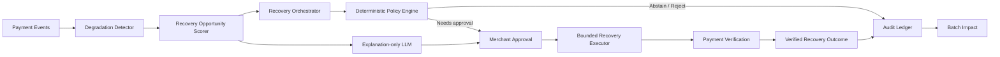
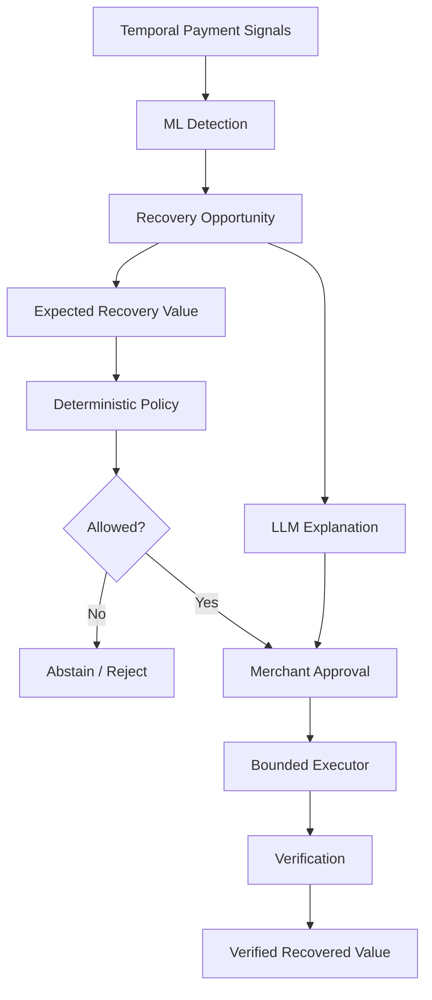

# FlowGuard RecoveryPilot 2.0

**AI-powered revenue recovery with bounded execution.**

**Track 03 — AI Revenue Recovery** · **Demo status: ready** ·
[Repository](https://github.com/nishant-uxs/flowguard-recoverypilot)

> This submission runs in `SIMULATION / DEMO MODE` by default. It does not
> represent production Razorpay traffic or production revenue.

## The Problem

Payment degradation can silently turn into lost revenue before a merchant knows
which interventions are actually worth taking.

## The Solution

FlowGuard detects degradation, ranks recovery opportunities by expected value,
applies deterministic safety controls, gets merchant approval, executes one
bounded recovery action, verifies the outcome, and measures the result against a
fixed baseline.

## Why This Is Different From Retry

Fixed retry asks, “Should I retry?” FlowGuard asks, “Which recovery opportunity
is worth spending an intervention on?” Not every failure is equally
recoverable: probability, amount, timing, merchant context and retry history
vary. Intervention budgets are limited, duplicate actions are dangerous,
merchant approval is required, and only verification proves recovery.

## How It Works

1. Detect gradual merchant-level degradation in the UPI Intent segment.
2. Estimate recovery probability and expected recovery value.
3. Rank opportunities under a bounded intervention budget.
4. Apply deterministic policy and obtain merchant approval.
5. Execute at most one payment-link attempt.
6. Verify paid status and `amount_paid`.
7. Record an auditable outcome and compare against the fixed baseline.

## Architecture



The implementation details and trust boundaries are in
[docs/architecture.md](docs/architecture.md) and
[docs/agent-architecture.md](docs/agent-architecture.md).

## AI / ML



**ML estimates. Policy authorizes. LLM explains. Executor acts. Verification
proves recovery.**

We tested a small GRU and did not promote it: the original perfect F1 concealed
weak useful lead time and calibration. The simpler logistic model offered the
better evidence-to-complexity tradeoff. See [docs/ai-design.md](docs/ai-design.md).

## Recovery Workflow

The recovery semantic is:

```text
INTERVENTION → PAYMENT ATTEMPT → VERIFICATION → RECOVERED VALUE
```

Creating a payment link is not recovery. A recovered outcome requires verified
paid status and a positive, candidate-bounded `amount_paid`. Merchant approval,
one-attempt limits, expiry, cooldown, idempotency and policy checks remain
deterministic.

## Safety Model

- Simulation is the default executor.
- Razorpay execution requires explicit `rzp_test_` credentials.
- The policy engine owns amount, value, confidence, expiry and attempt limits.
- Merchant approval is required before execution.
- SHA-256 idempotency keys prevent duplicate actions, including concurrent
  identical submissions.
- Pending, failed, expired and already-recovered outcomes do not count as
  recovered value.
- The LLM has no payment tool, approval field, policy field or executor command.
- Unsafe or unavailable LLM output falls back deterministically.

## Evaluation

M4.5 evaluates temporal degradation detection on synthetic, merchant-disjoint
and shifted holdouts. It does not establish production accuracy or broad
generalization. The GRU result is retained as an engineering warning rather
than hidden.

M6 evaluates opportunity ranking under an explicit synthetic response model.
The hidden counterfactual outcome is unavailable to the scorer; both strategies
use the same candidate pool, budgets, timing context, approval availability,
amount limits, executor outcomes and verification rules.

## M6 Results

**SYNTHETIC EVALUATION — synthetic recovered-value units across 20-seed
evaluation.** Across 20 independent seeds and intervention budgets of 10, 25,
50, 75 and 100, FlowGuard beat the fixed baseline under the synthetic
recovery-response model.

| Budget | FlowGuard |  Baseline |
| -----: | --------: | --------: |
|     10 |  42,047.3 |  15,776.9 |
|     25 |  87,176.1 |  43,997.6 |
|     50 | 150,936.9 |  85,373.5 |
|     75 | 213,813.0 | 130,404.9 |
|    100 | 260,208.8 | 171,138.8 |

These are not rupees, Razorpay revenue, production success probabilities or a
guaranteed uplift. The full methodology is in
[docs/evaluation.md](docs/evaluation.md).

## Demo

### Start locally

Requirements: Node.js 22+ and npm 11+.

```bash
npm install
npm run dev:api
```

In a second terminal:

```bash
npm run dev:web
```

Open the Vite URL shown in the terminal. The API health check is
`http://localhost:3001/health`.

### Judge flow

1. Open the Control Tower.
2. Select **Successful Recovery**.
3. Review the **Model Signal** and expected simulated value.
4. Review the deterministic policy checks.
5. Click **Approve recovery**.
6. Watch the bounded action and verification stages.
7. Confirm the verified simulated recovery outcome.
8. Inspect the audit timeline.
9. Review the synthetic FlowGuard-versus-baseline impact.
10. Select **Duplicate Prevention** and show `IDEMPOTENCY REPLAY`.

See [docs/demo-script.md](docs/demo-script.md) for the two-minute narration.

## Failure Scenarios

The selector provides deterministic **Policy Rejection**, **Duplicate
Prevention**, **Abstention**, **Expired Action** and **Verification Failure**
cases. The API and recovery tests also cover missing approval, already-paid
state, executor failure, verification timeout, crash/retry reconciliation,
malformed LLM output, provider unavailability and prompt-injection text.

## Tech Stack

- TypeScript, React, Vite and Fastify
- Zod contracts for domain, API and explanation boundaries
- Deterministic logistic/temporal evaluation experiments
- Simulation executor with an isolated Razorpay TEST MODE adapter
- Vitest, Testing Library, ESLint and Prettier

## Repository Structure

- `apps/api` — Fastify demo API and deterministic scenario controller.
- `apps/web` — React Control Tower and API client.
- `packages/domain` — payment-event contracts.
- `packages/recovery` — policy, orchestration, executors, verification and
  audit contracts.
- `evaluation` — M2–M6 synthetic datasets, models and reports.
- `docs` — architecture, demo, audit and judge-facing documentation.

## Running Locally

```bash
npm run typecheck
npm run lint
npm test
npm run format:check
npm run build
```

Evaluation commands are available for the reproducible synthetic protocols:

```bash
npm run evaluate:baseline
npm run evaluate:ml
npm run evaluate:generalization
npm run evaluate:recovery
npm run evaluate:recovery-value
```

## Razorpay TEST MODE

`RazorpayTestRecoveryExecutor` is opt-in, requires an `rzp_test_` key, creates
one Payment Link, and verifies it through the Payment Link fetch API. The
default demo never calls Razorpay. No production key, production endpoint or
real-money operation is enabled by this repository.

## Evidence Boundaries

- **SYNTHETIC EVALUATION** means generated datasets and counterfactual outcomes.
- **DEMO / SIMULATION** means the fixed-seed local Control Tower journey.
- **RAZORPAY TEST MODE** means an explicitly configured test adapter only.

The evaluation environment is synthetic and does not represent production
Razorpay traffic. Demo values are simulated units, not production revenue.

## Limitations

- Synthetic datasets and a synthetic recovery-response model.
- Seeded demo inputs rather than live model inference.
- No production Razorpay traffic or production revenue claim.
- Razorpay integration is TEST MODE only.
- LLM output is explanation-only.
- M4.5 does not establish production generalization.
- M6 demonstrates value only under the stated synthetic response model.

## Future Production Path

1. Run shadow evaluation on privacy-safe real payment outcomes.
2. Calibrate recovery probability on outcome-backed TEST MODE data.
3. Add merchant-specific drift and safety monitoring.
4. Validate controlled TEST MODE behavior with explicit approval.
5. Stage rollout behind stopping and rollback controls.
6. Monitor production outcomes and customer/merchant impact.

## Buildathon Track

FlowGuard maps directly to **Track 03 — AI Revenue Recovery**:

```text
revenue at risk
→ intervention
→ bounded recovery workflow
→ verified recovered value
→ compliant escalation and stopping rules
→ audit trail
```

## License

No open-source license has been declared for this buildathon submission.

For concise judge answers, see [docs/judge-questions.md](docs/judge-questions.md),
[docs/final-audit.md](docs/final-audit.md) and
[docs/30-second-pitch.md](docs/30-second-pitch.md).
