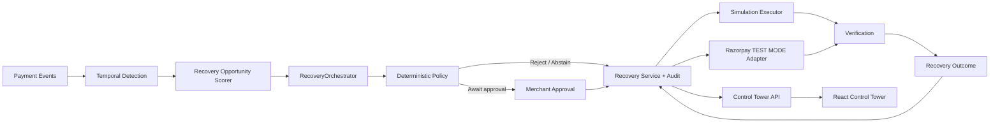
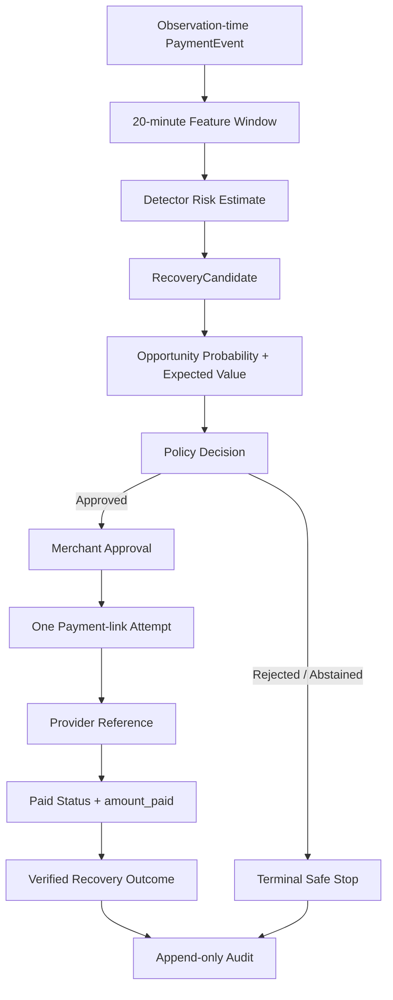
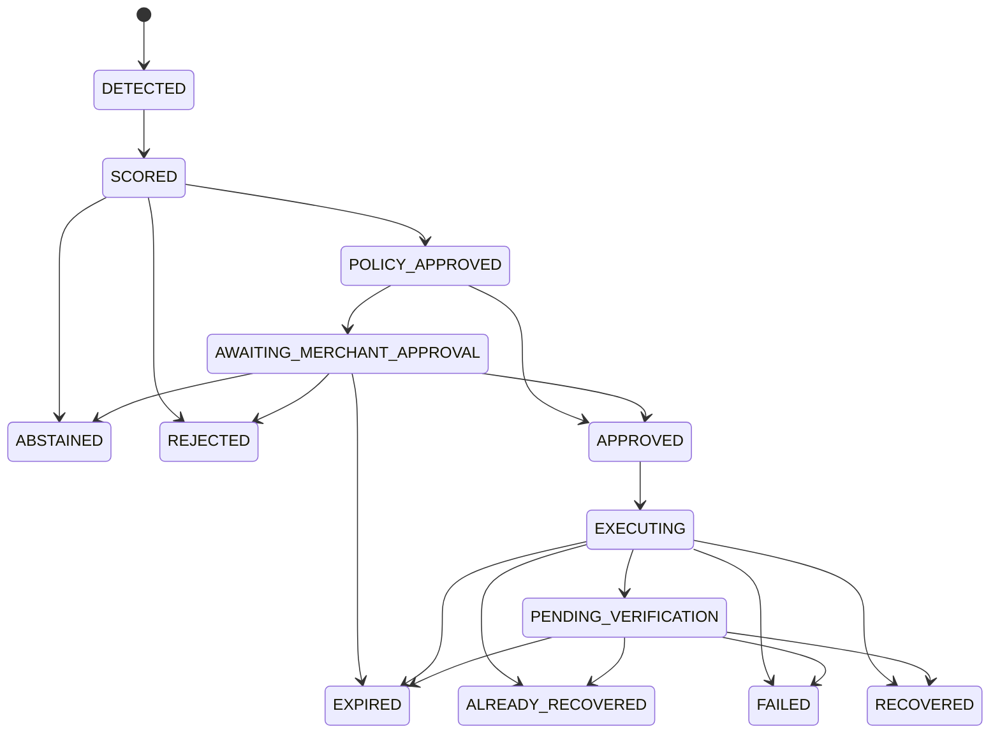
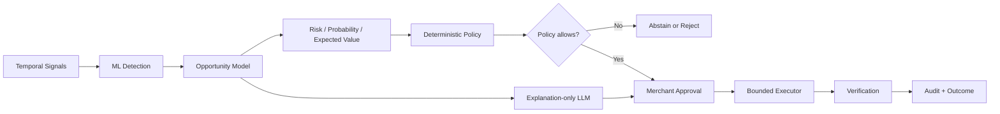
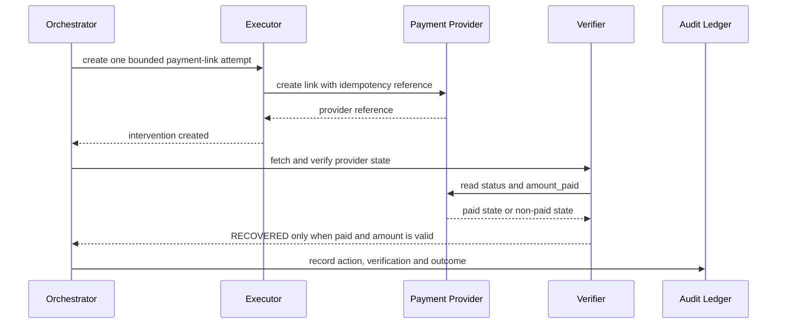

# FlowGuard RecoveryPilot 2.0 — Architecture

## M0 stack

- TypeScript across the application
- npm workspaces for separated API and web applications
- Fastify for the API
- React and Vite for the web application
- Zod for runtime environment and domain validation
- Vitest for tests
- ESLint and Prettier for quality gates

## Layer boundaries

```text
apps/web
  -> apps/api
       -> domain
       -> detection and inference
       -> explanation adapter
       -> policy engine
       -> recovery executor
       -> verification
       -> audit and evaluation
```

The M0 API exposes only a health endpoint. No ML, LLM, Razorpay or financial
action code exists at this milestone.

## System architecture



The simulation and Razorpay adapters implement the same executor boundary; only
the simulation adapter is selected by the default demo.

## M1 domain boundary

`packages/domain` owns the runtime-validated raw event contract. It currently
contains only:

- `PaymentEvent`: one observed payment-attempt event.
- `MerchantContext`: the merchant identifier used to group temporal streams.
- `PaymentMethodSegment`: a constrained method/segment pair.

The event schema is intentionally observation-time only. It includes timestamp,
payment outcome, value and retry/latency context, but excludes recovery success,
recovered value, future failure counts and degradation labels. Those are
derived or outcome data and would leak future information into detection.

Validation is strict: identifiers, timestamps, currency, status, method/segment,
amount and retry count are checked at the boundary. A failed event must carry an
observable failure category; non-failed events must not carry one.

## Runtime decision boundary

The runtime uses this one-way control flow:

```text
model prediction
  -> structured recommendation
  -> deterministic policy validation
  -> approval or abstention
  -> idempotent executor
  -> verifier
```

The model and LLM will not have unrestricted access to financial tools.
The executor will be selected through an interface with simulation and
Razorpay Test Mode implementations.

## Reliability principles

- Every action has an idempotency key.
- The policy engine enforces amount, confidence, cooldown and retry limits.
- API timeouts become pending outcomes, not assumed successes.
- Duplicate requests are rejected deterministically.
- Every state transition is recorded in the audit ledger.
- The evaluation command is replayable from a fixed seed and versioned data.

## M2 temporal data boundary

`evaluation/generator/temporal-dataset.ts` produces observable
`PaymentEvent[]` data from latent merchant/segment state. The latent state
drives correlated changes in failure rate, latency and volume over five-minute
windows, but is kept in a separate truth artifact.

The default target is the UPI Intent segment. Other segments are generated with
their own heterogeneous baselines and act as controls; they do not receive the
target degradation scenario. Degraded merchants vary in start time, duration,
noise and natural recovery.

The raw export, hidden truth and temporal split manifest are separate files.
This prevents future degradation labels and outcomes from entering the event
contract. The generator uses a fixed seed, random non-semantic IDs and
merchant-aware profile assignment so repeated runs are identical without
encoding the label in an identifier.

## Data flow



Future labels, hidden counterfactual outcomes and latent propensity enter only
the evaluation protocols; they do not enter runtime feature construction.

## M3 baseline boundary

The baseline is intentionally interpretable. It calibrates each merchant from
the first 12 target-segment windows, transforms rolling failure-rate and
latency deviations into a positive EWMA score, and accumulates signed
deviations with one-sided CUSUM. Persistence, reset and cooldown logic emit
one episode-level alert instead of one alert per noisy window.

The detector receives only chronologically available observations. Truth
intervals are used by the evaluation layer only, never by the detector. The
naive comparator is a global rolling failure-rate threshold. Both use the same
episode-level evaluation protocol and untouched test period.

## M4 ML experiment boundary

The ML experiment is isolated under `evaluation/ml`. It consumes four
five-minute feature windows and predicts degradation onset during the next
30 minutes. Feature construction is past-only and excludes merchant IDs,
scenario labels and future aggregates. The training split excludes the
merchant holdout; validation selects probability thresholds and test is read
only after the operating point is frozen.

The first model is class-weighted logistic regression over flattened temporal
features. A single small GRU is evaluated separately as a sequence model. The
GRU is an offline experiment, not a runtime dependency or a recovery policy.
The local run used CPU because the installed PyTorch build exposed no CUDA
device. No model is allowed to trigger payments, call an LLM or bypass the
future recovery approval boundary.

## M4.5 evaluation boundary

M4.5 preserves the v1 generator and results and adds an independent v2
protocol under `evaluation/generalization`. Its observable events contain no
scenario labels or future outcomes. Known merchants use A/B/C degradation
families; a merchant-disjoint holdout contains shifted mechanisms D/J and
stress/confounder cases. Merchant IDs and scenario metadata are truth/audit
data, never model features.

The hardening evaluator gives every model the same episode matcher,
30-minute prediction horizon, 30-minute useful intervention window,
cooldown/debounce rule and lead-time metrics. It reports early, late-useful,
late-useless and false alerts separately. Normalized utility is parameterized
and sensitivity-tested; it is not a revenue estimate. Platt calibration and
model operating thresholds are fitted on known validation predictions only.
The v2 audit checks duplicate identifiers, merchant/scenario overlap and
simple artifact probes.

This boundary remains offline. It can inform whether a bounded demo recovery
layer is worth building, but M4.5 does not authorize production claims,
payment execution, an LLM, or dashboard integration. The first GRU's perfect
v1 F1 is explicitly treated as an evaluation warning rather than a product
decision.

## M5 recovery boundary

The bounded recovery workflow lives behind `@flowguard/recovery`:

```text
RecoveryCandidate
  -> RecoveryRecommendation
  -> deterministic policy
  -> merchant approval
  -> RecoveryExecutor
  -> verification
  -> RecoveryOutcome + audit events
```

The quantitative model supplies a score and reasons only. Policy enforces
minimum confidence, expected value, amount limit, one attempt and 30-minute
expiry. Approval is explicit; rejection, abstention, duplicate prevention,
expiry and verification timeout are terminally auditable outcomes.

`SimulationRecoveryExecutor` is the deterministic default for the demo.
`RazorpayTestRecoveryExecutor` is isolated behind the same interface and
requires an `rzp_test_` key. It creates a Payment Link through
`POST /v1/payment_links` and verifies it through the Payment Link fetch
endpoint; only a paid link's verified `amount_paid` counts. The adapter does
not claim that link creation is recovery and was not called by the batch.
The implementation follows Razorpay's documented [Payment Links API](https://razorpay.com/docs/api/payments/payment-links/)
and [Payment Link webhook events](https://razorpay.com/docs/webhooks/payment-links/);
real credentials and merchant approval are required for a live TEST MODE run.

## Recovery state machine



All terminal states are auditable. Invalid transitions throw before an
executor can be called.

The application-facing audit ledger is append-only from the service API and
records candidate, recommendation, policy, approval, action, verification,
outcome and duplicate events, including source event ID, payment, merchant,
model version, score and idempotency key. The batch comparison is explicitly
simulated; no production payment operation is enabled by M5.

## M6 opportunity boundary

M6 keeps detection and recovery opportunity prediction separate. The detector
answers whether degradation is emerging; the opportunity scorer answers
whether intervening now is likely to recover value. Its inputs are
decision-time observable proxies only: amount, severity, elapsed time,
merchant history, customer responsiveness, retries, latency and intervention
cost.

The M6 evaluator generates hidden counterfactual potential outcomes from
latent factors and noisy observations. Hidden propensity and post-intervention
success are evaluator-only fields. Twenty independent seeds and five
intervention budgets test ranking rather than a single favorable batch. M6
reports simulated value curves, Precision@K, recall, calibration, timing and
sensitivity while preserving the M5 report.

On this synthetic response model FlowGuard has higher mean simulated value at
every budget, but this is not production evidence. Real opportunity
calibration requires observed TEST MODE outcomes before any production claim.

## M7 orchestration and explanation boundary

`RecoveryOrchestrator` makes the complete flow explicit:

```text
events -> detector -> opportunity scorer -> orchestrator
       -> policy -> merchant approval -> executor -> verification -> audit
       -> batch value
                    \
                     -> explanation-only LLM or deterministic fallback
```

The orchestrator uses a validated state machine from `DETECTED` through
`SCORED`, policy approval, merchant approval, execution, verification and a
terminal outcome. The LLM receives only allow-listed structured fields and
cannot authorize, execute, change limits, alter idempotency or write audit
records. Unsafe, malformed, unavailable or prompt-injected provider output is
discarded in favor of a deterministic explanation.

M7 does not add an autonomous agent loop. Simulation remains the default and
the Razorpay adapter requires explicit TEST MODE credentials. See
`docs/agent-architecture.md` for the state and trust-boundary diagrams.

## AI and policy boundary



ML estimates; deterministic policy authorizes; the LLM explains; the executor
acts; verification proves recovery. No LLM output is consumed as an action or
authorization command.

## Recovery verification



Link creation is an intervention. Only verified paid status and bounded
`amount_paid` produce recovered value.

## M8 demo boundary

The Control Tower consumes structured state from the local demo API. Its default
state is a fixed-seed `SimulationRecoveryExecutor` journey; it does not
recalculate policy, eligibility, value, idempotency or verification in React.
The UI labels `DEMO / SIMULATION`, `SYNTHETIC EVALUATION` and `RAZORPAY TEST
MODE` as separate provenance classes. It exposes the model signal for the
judge, but the seeded demo score is not a live detector prediction.
